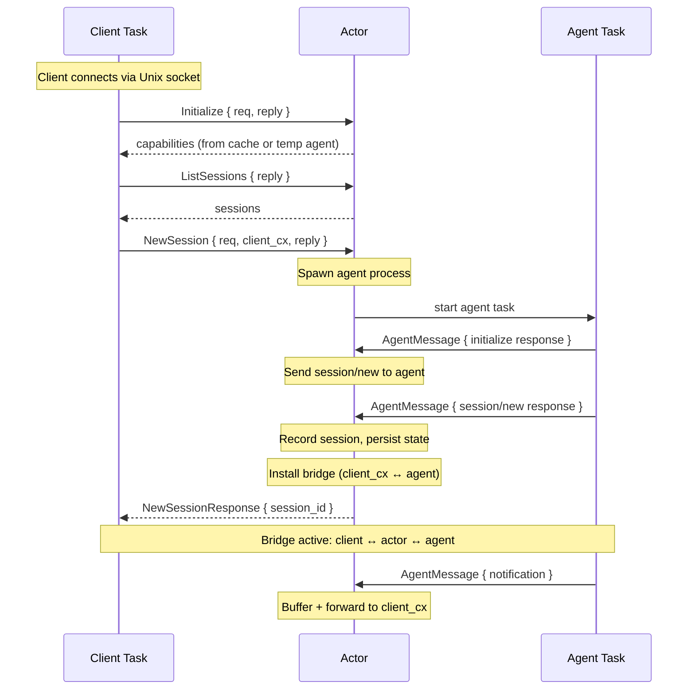
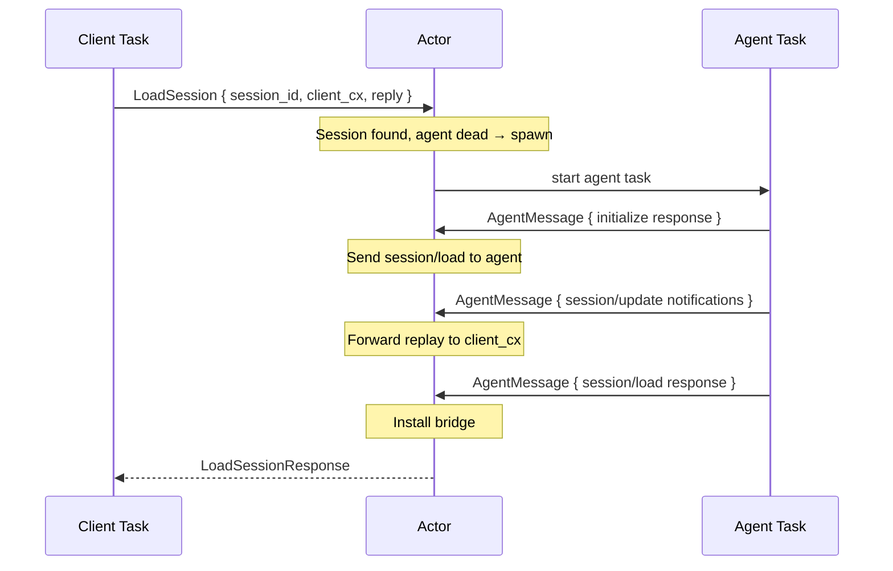
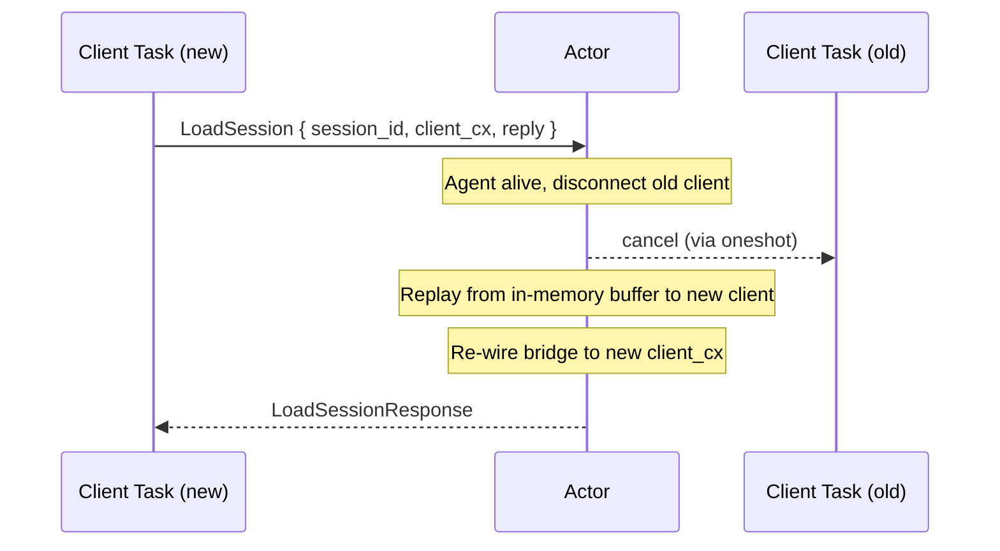
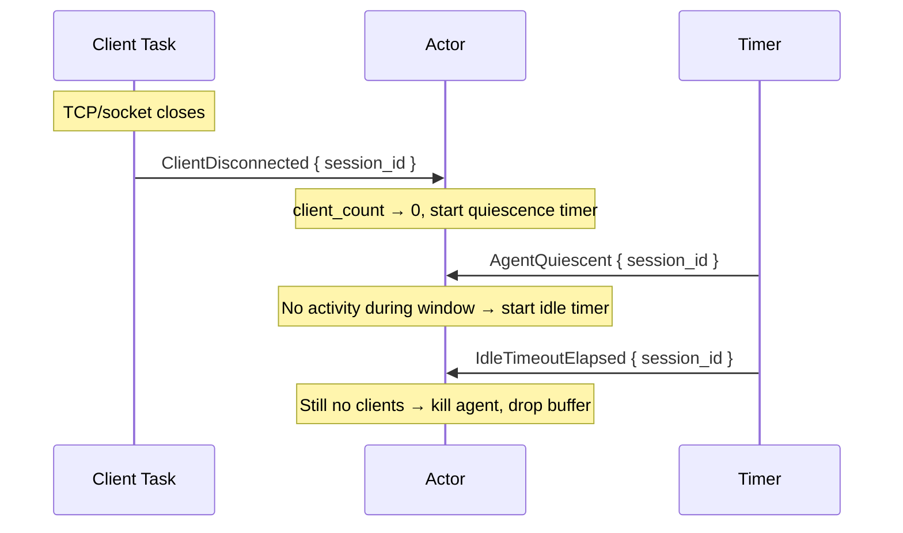
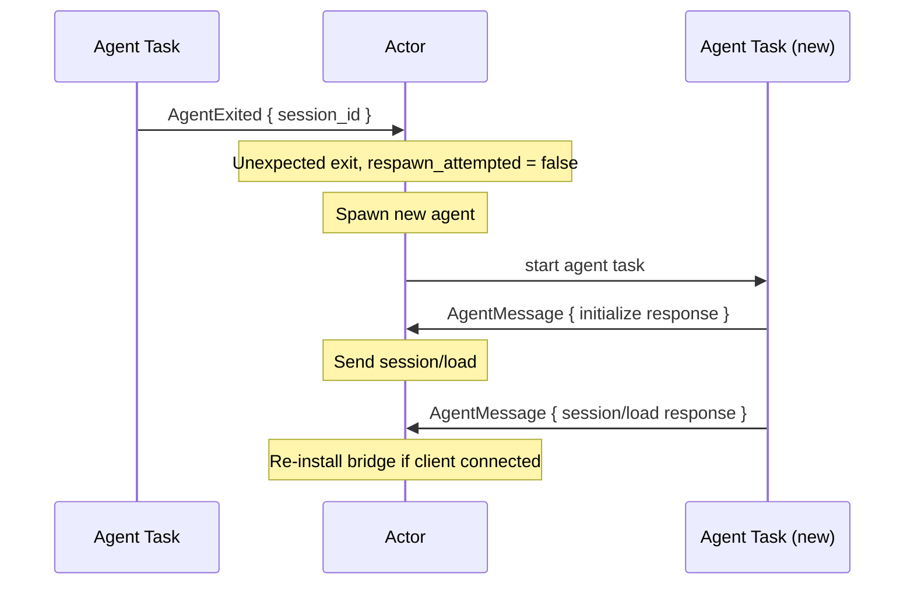
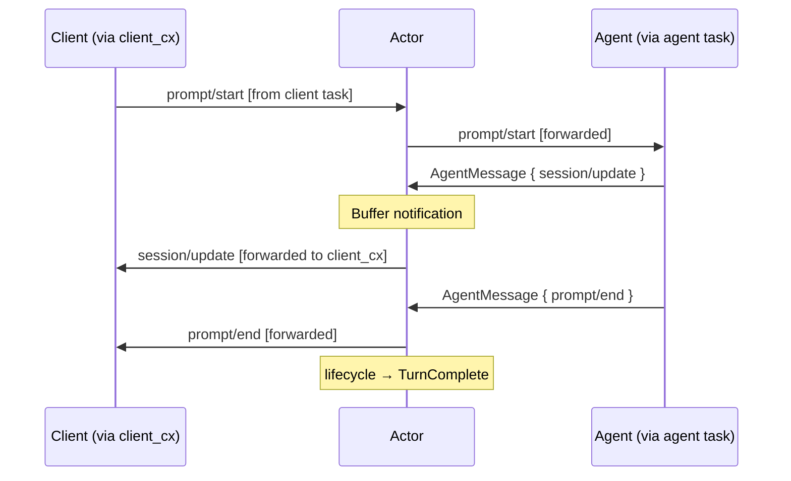

# Daemon actor architecture

The daemon uses a **central actor** pattern: a single task owns all mutable session state and processes events sequentially from an mpsc channel. Client connections, agent connections, and timers all communicate with the actor by sending messages into this channel. This eliminates shared mutable state (`Arc<Mutex<...>>`) and ensures lifecycle transitions are race-free.

## Architecture overview

```
┌──────────────────────────────────────────────────────────────────┐
│                            Daemon                                 │
│                                                                  │
│   ┌────────────┐         ┌──────────────────┐                   │
│   │ Unix Socket│──accept──>│  Client Task   │                   │
│   │  Listener  │         │  (per-connection)│                   │
│   └────────────┘         └────────┬─────────┘                   │
│                                   │                              │
│                              actor_tx                             │
│                                   │                              │
│                          ┌────────▼─────────┐                   │
│                          │   Daemon Actor   │                   │
│                          │                  │                   │
│                          │  - sessions map  │                   │
│                          │  - state file    │                   │
│                          │  - lifecycle     │                   │
│                          └────────┬─────────┘                   │
│                                   │                              │
│                     ┌─────────────┼─────────────┐               │
│                     │             │             │                │
│              ┌──────▼──────┐ ┌────▼────┐ ┌─────▼──────┐        │
│              │ Agent Task  │ │  Timer  │ │ Agent Task │        │
│              │ (session A) │ │  Events │ │ (session B)│        │
│              └─────────────┘ └─────────┘ └────────────┘        │
└──────────────────────────────────────────────────────────────────┘
```

The key invariant: **only the actor task reads or writes session state**. Everything else sends a `DaemonMessage` and (optionally) awaits a reply via a oneshot channel.

## Message types

The actor has two distinct enums: **`DaemonMessage`** (inputs that drive the actor) and **`DaemonEvent`** (outcomes emitted for observers).

### `DaemonMessage` — inputs to the actor

```rust
enum DaemonMessage {
    /// Client requests: initialize, list, new, load, resume.
    /// Each carries a oneshot::Sender for the reply.
    Initialize { req, reply },
    ListSessions { req, reply },
    SessionNew { req, client_cx, reply },
    SessionLoad { req, client_cx, reply },
    SessionResume { req, client_cx, reply },

    /// A message arrived from a client connection (bridged mode).
    ClientMessage { session_id, dispatch },

    /// A message arrived from an agent's stdio.
    AgentMessage { session_id, dispatch },

    /// A client disconnected (socket closed or superseded).
    ClientDisconnected { session_id },

    /// An agent process exited (expected or crash).
    AgentExited { session_id },

    /// Quiescence window elapsed (carries generation for staleness check).
    AgentQuiescent { session_id, generation },

    /// Idle timeout elapsed (carries generation for staleness check).
    IdleTimeoutElapsed { session_id, generation },

    /// Periodic working-directory health check fired.
    CwdHealthCheck,
}
```

### `DaemonEvent` — outcomes for observers

```rust
enum DaemonEvent {
    Initialized,
    ClientConnected,
    ClientDisconnected { session_id: Option<String> },
    SessionCreated { session_id },
    SessionLoaded { session_id },
    SessionResumed { session_id },
    AgentLaunched { session_id },
    AgentQuiescent { session_id },
    AgentStopped { session_id },
}
```

The actor emits `DaemonEvent` values into a separate unbounded channel for subscribers (tests, tracing). These are purely observational — the actor never receives them back.

## Fresh connection — new session (internal)



## Reconnect — load session, agent dead (internal)



## Reconnect — load session, agent alive (internal)



## Client disconnect and idle spin-down (internal)



## Agent crash and respawn (internal)



## Message flow through the bridge

During normal operation, the actor routes messages bidirectionally:



## Design principles

**Single writer**: The actor is the sole owner of `sessions: HashMap<String, LiveSession>`. No mutexes needed for session state.

**Inputs vs events**: `DaemonMessage` is what the actor processes; `DaemonEvent` is what it emits. Tests subscribe to the event channel and assert on outcomes. The two enums are cleanly separated — no variant appears in both.

**Request-reply via oneshot**: Client tasks that need a response (e.g., `SessionNew`) include a `tokio::sync::oneshot::Sender` in the message. The actor computes the answer and sends it back. The client task awaits the oneshot.

**Fire-and-forget for events**: Messages like `ClientDisconnected`, `AgentExited`, and timer expirations don't need replies — the actor handles them unilaterally.

**Timers as messages**: Instead of spawning timer tasks that grab mutexes, the actor spawns lightweight tasks that simply sleep and then send `AgentQuiescent` / `IdleTimeoutElapsed` back to the actor channel. The actor checks whether the timer is still relevant (client may have reconnected) before acting.

**Agent task isolation**: Each live agent has a dedicated task that reads from the agent's stdio and sends `AgentMessage { session_id, message }` into the actor channel. The actor decides what to do with each message (buffer it, forward to client, update lifecycle state). If the agent process exits, the task sends `AgentExited`.
