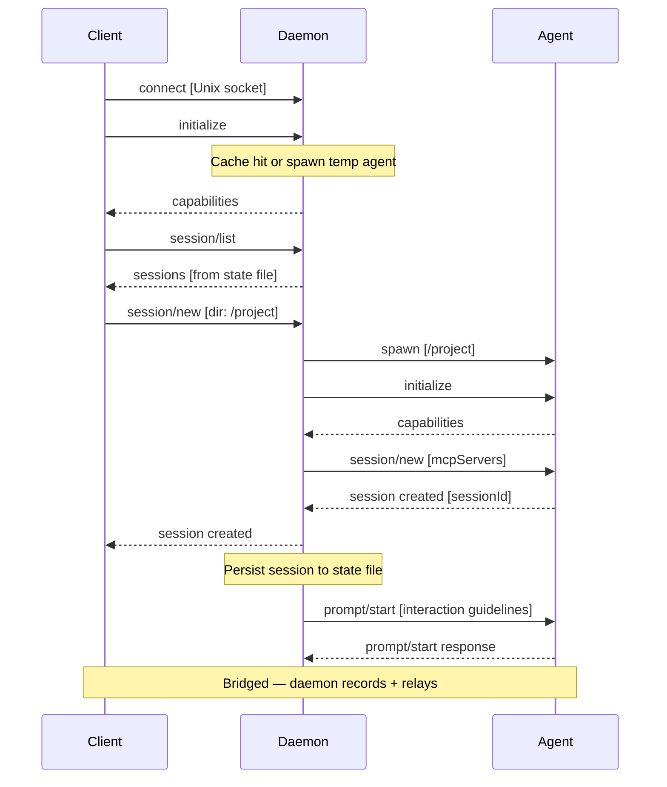
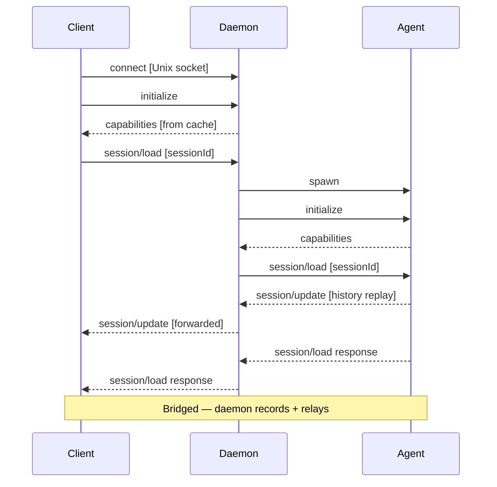
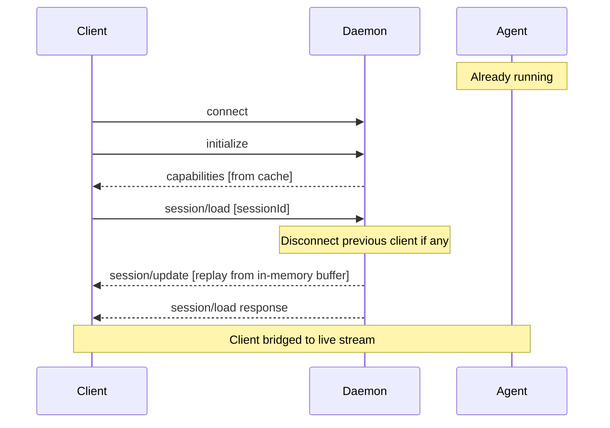
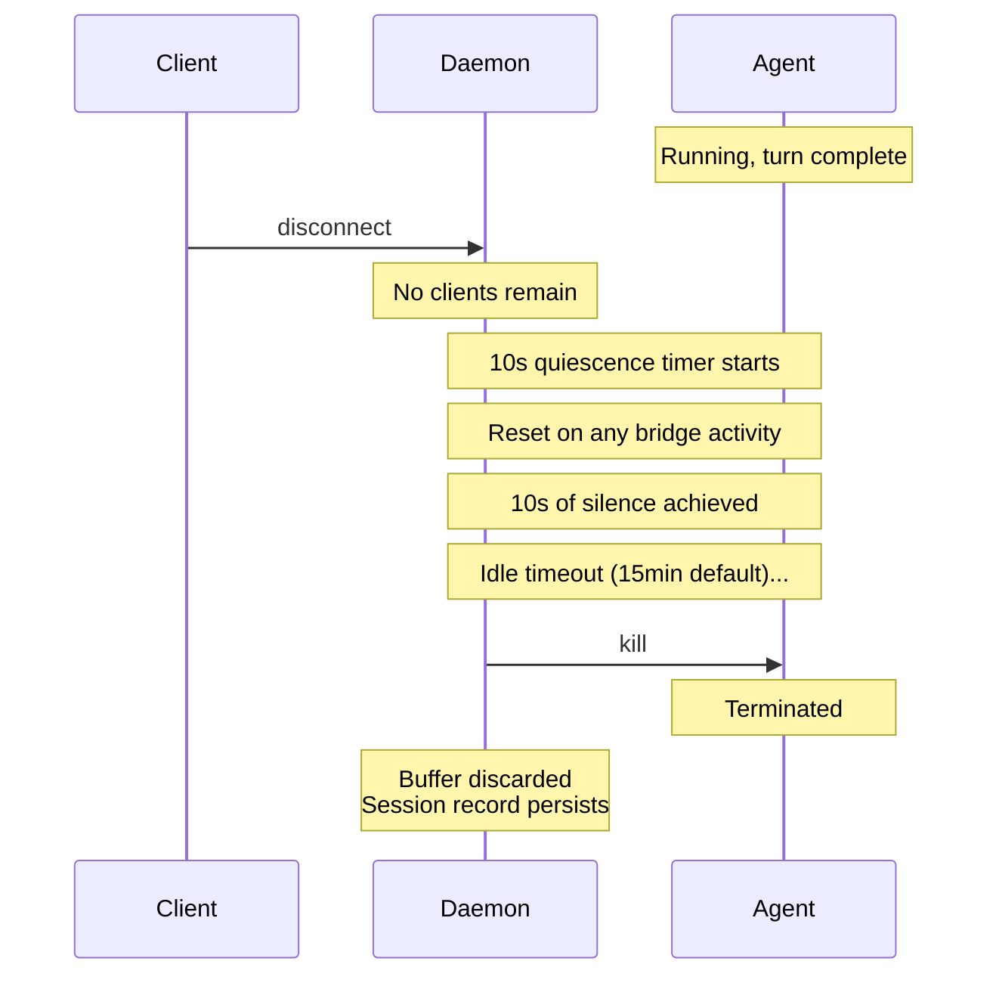
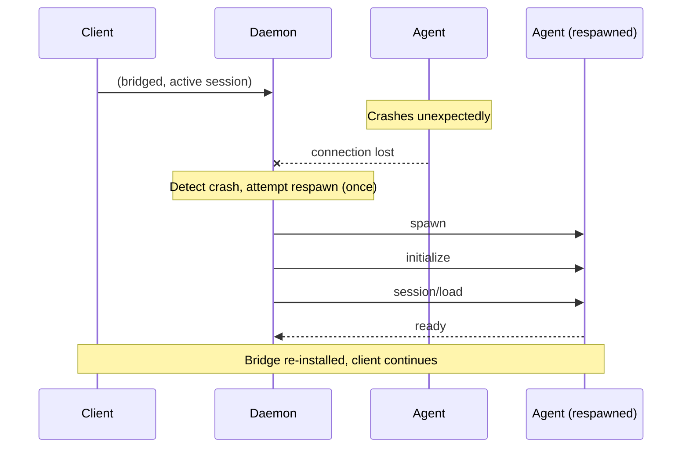
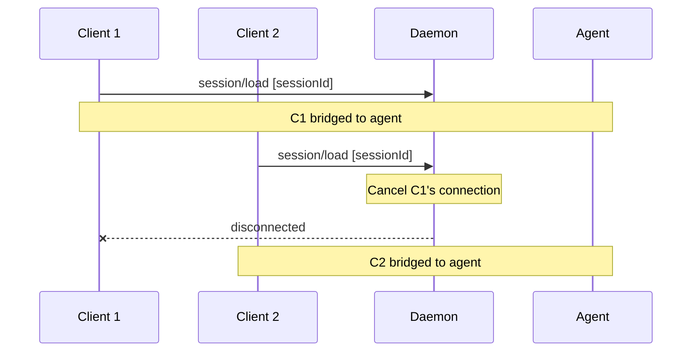
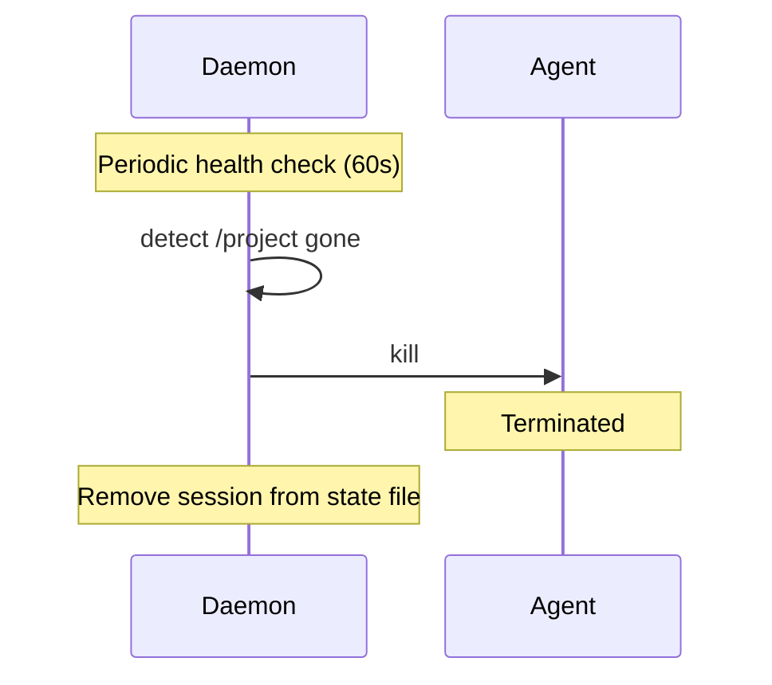

# Key sequence diagrams

## Fresh connection -- new session

## Reconnect -- load session (agent dead)

## Reconnect -- load session (agent alive)

## Idle spin-down

## Auto-respawn on crash

## One-client-per-session enforcement

## Directory deleted -- session cleanup

