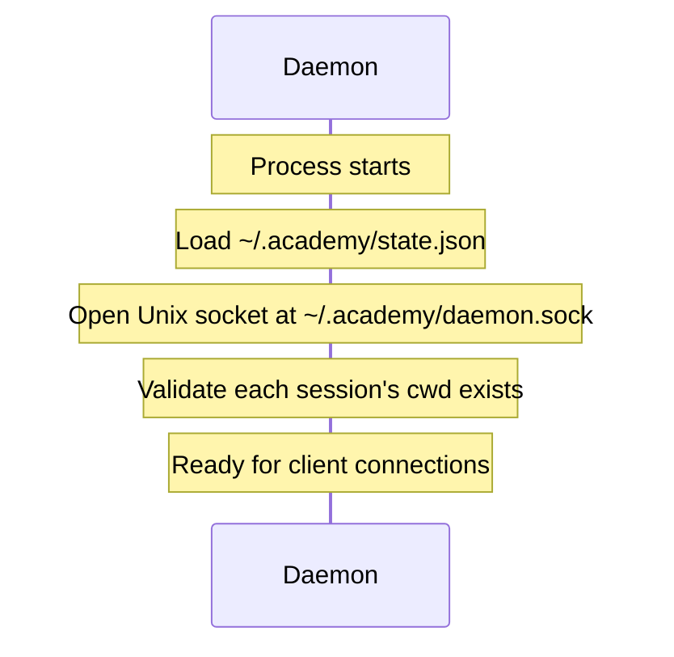
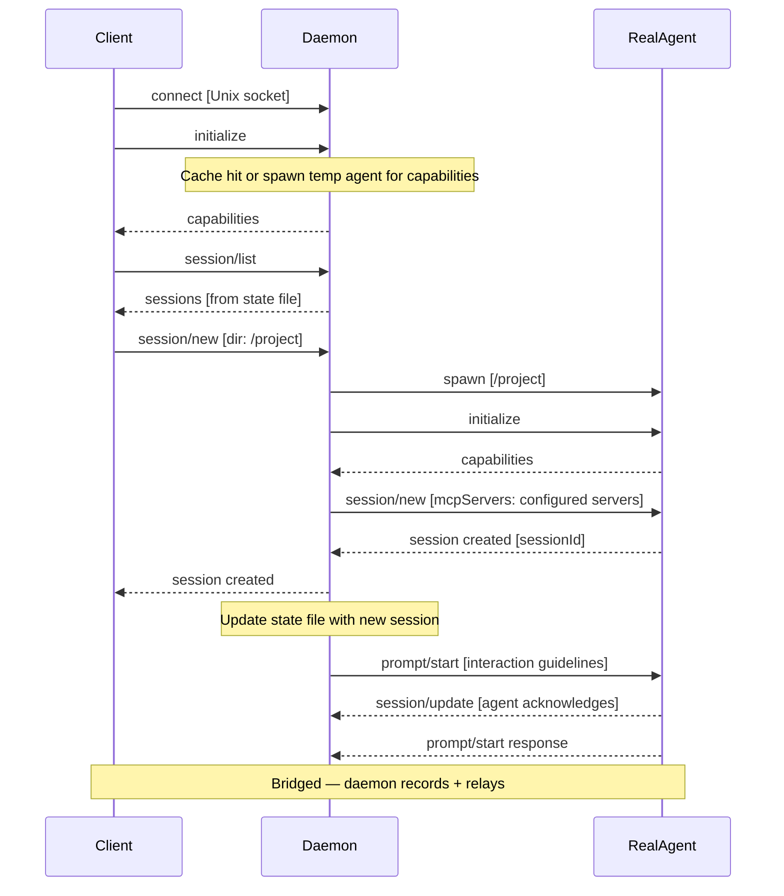
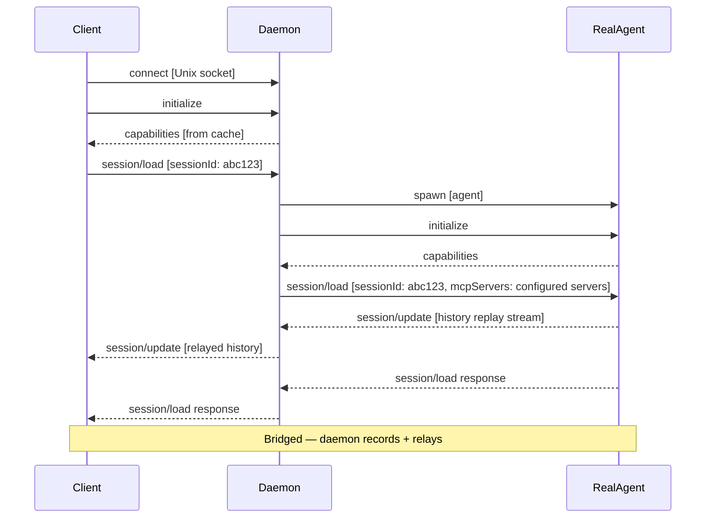
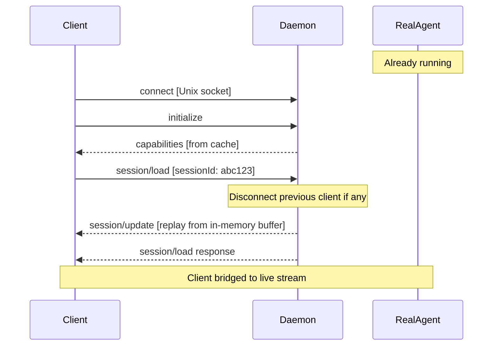
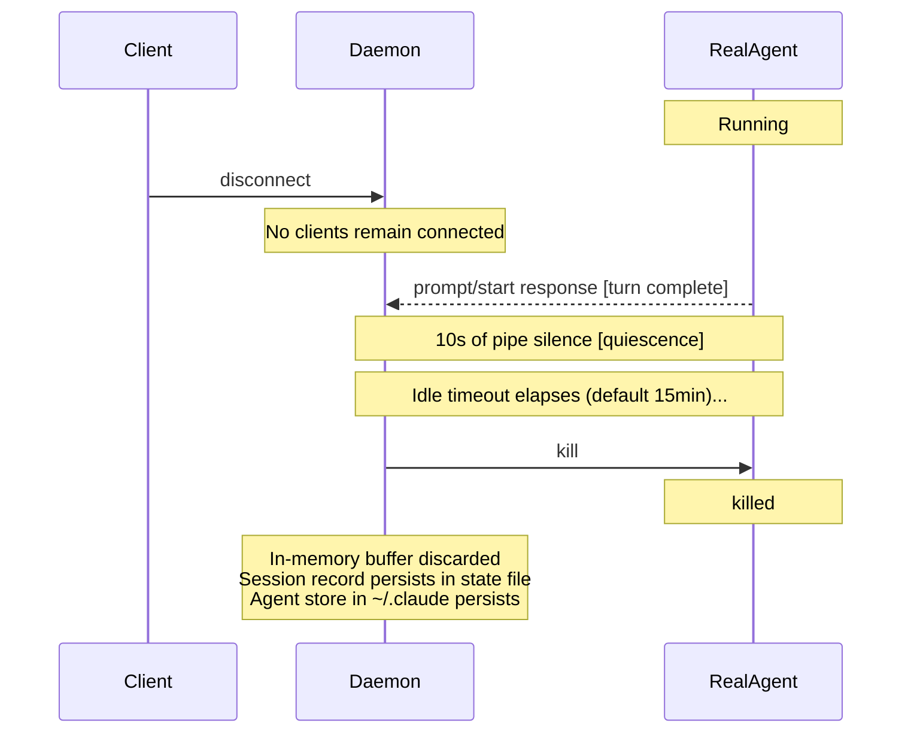
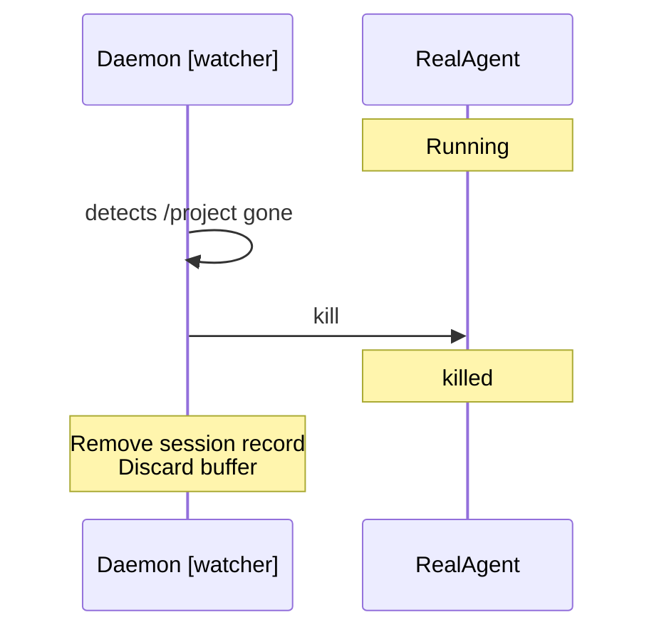
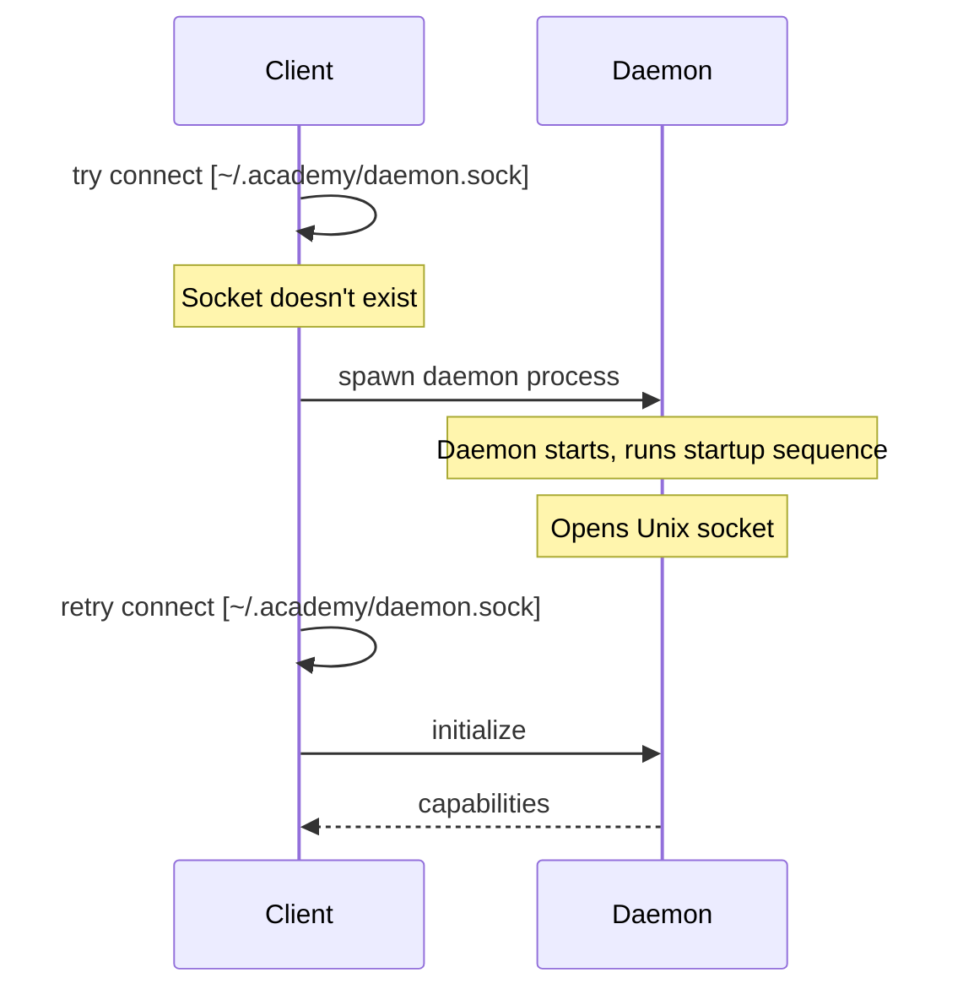

# Feature Specification: Agent Daemon

**Feature Branch**: `001-agent-daemon`

**Created**: 2026-06-02

**Status**: Draft

**Input**: User description: "Daemon managing lifecycle of async agents with ACP and session resume"

## User Scenarios & Testing *(mandatory)*

### User Story 1 - Connect and Start/Resume a Session (Priority: P1)

A developer's editor launches a client executable that connects to the daemon via a Unix domain socket (`~/.academy/daemon.sock`). If the daemon isn't running, the client spawns it first. The daemon is the sole ACP endpoint — the client never communicates directly with an agent. The daemon answers `initialize` (from capabilities cache, spawning a temp agent on first-ever connect) and `session/list` (from its persistent state file), then on `session/new` or `session/load`, spawns (or reuses) an agent for the requested directory.

**Why this priority**: This is the core interaction model — without session lifecycle management, nothing else works.

**Independent Test**: Can be fully tested by starting a daemon, connecting a client, creating a session, disconnecting, reconnecting, resuming, and verifying history is replayed.

**Acceptance Scenarios**:

1. **Given** a client connects to the daemon, **When** ACP init completes, **Then** the client can query `session/list` and see available sessions (answered from state file).
2. **Given** the client sends `session/new` for a directory, **When** the daemon processes it, **Then** it spawns an agent, sends interaction guidelines as the first prompt, and bridges the client.
3. **Given** the client sends `session/load` for an existing session (agent dead), **When** the daemon processes it, **Then** it spawns an agent, sends `session/load`, and relays the agent's history replay to the client.
4. **Given** the client sends `session/load` for a session with a running agent, **When** the daemon processes it, **Then** it replays its in-memory buffer to the client and bridges them to the live stream.
5. **Given** the client sends `session/resume` for a session (agent dead), **When** the daemon processes it, **Then** it spawns the agent, sends `session/load` (buffering the replay without relaying), and bridges the client once load completes.
6. **Given** the client sends `session/resume` for a session with a running agent, **When** the daemon processes it, **Then** it bridges the client immediately (no replay).
7. **Given** a session already has a connected client, **When** a second client sends `session/load` for the same session, **Then** the first client is disconnected before the second is bridged (one client per session).
8. **Given** a connected client, **When** it disconnects and no other clients remain, **Then** the idle timer starts (after turn completion + quiescence).

---

### User Story 4 - Agent Process Lifecycle (Priority: P2)

The agent process is ephemeral — it only runs when there's work to do. A connected client keeps the agent alive. After the last client disconnects and the agent completes its turn, the daemon waits for pipe quiescence (10 seconds of silence) then starts an idle timer. When the timer expires, the agent is killed. The agent's internal session store (inside `~/.claude`) and the daemon's state file persist across spin-downs. When new input arrives (client connects or external event), the daemon spawns a fresh agent via `session/load`.

**Why this priority**: Essential for resource efficiency — without this, idle agents consume memory/CPU indefinitely across potentially many project directories.

**Independent Test**: Can be tested by starting a session, letting the agent go idle, verifying the process is killed after timeout, then sending new input and verifying the agent resumes with full context.

**Acceptance Scenarios**:

1. **Given** an agent with a connected client, **When** the agent goes idle, **Then** the agent is NOT killed (client presence keeps it alive).
2. **Given** an agent with no connected client that has completed its turn, **When** 10 seconds of pipe silence pass and then the idle timeout elapses, **Then** the daemon kills the agent process.
3. **Given** a session with no running agent process, **When** a client sends `session/load`, **Then** the daemon spawns a new agent, sends `session/load`, and relays the replayed history to the client.
4. **Given** a session whose working directory has been deleted, **When** the daemon detects this, **Then** it terminates the agent process (if running) and removes the session entirely.

---

### Edge Cases

- What happens if the daemon crashes — can sessions be recovered on restart? (Yes — restart the temp agent, re-fetch session list.)
- What happens if an agent's process dies unexpectedly (OOM, crash) while a client is connected? The daemon auto-respawns the agent once (via `session/load`) and notifies the client of the interruption. If the respawned agent crashes again, the daemon reports an ACP error to the client without further retries.

## Clarifications

### Session 2026-06-03

- Q: What is the idle timeout duration before killing an agent after quiescence? → A: 15 minutes default, configurable at startup (overridable for integration tests)
- Q: What should the daemon do when an agent dies unexpectedly mid-turn (client connected)? → A: Notify the client and auto-respawn once (single retry); if it crashes again, report error to client
- Q: Where should the daemon log diagnostic information? → A: Log file at `~/.academy/daemon.log`
- Q: How does the daemon shut down? → A: Runs indefinitely once started; kill the process to stop it
- Q: Should the Unix socket have restricted permissions? → A: Yes — created with `0600` (owner-only access)
- Q: How is log verbosity controlled? → A: `~/.academy/config.toml` with `log_level` setting; `debug` = lifecycle events, `trace` = every ACP message. Per-session logs routed via tracing spans (session ID / cwd) into `~/.academy/sessions/<session-id>/session.log`

## Requirements *(mandatory)*

### Functional Requirements

**Daemon & Session Management**

- **FR-001**: System MUST implement the Agent Client Protocol (ACP) for communication between daemon, agents, and clients.
- **FR-002**: System MUST run as a background daemon, listening on a Unix domain socket at a well-known path (e.g., `~/.academy/daemon.sock`). The socket MUST be created with `0600` permissions (owner-only access).
- **FR-003**: System MUST auto-start on first client connect — if the socket doesn't exist, the client spawns the daemon and waits for it. Once started, the daemon runs indefinitely until its process is killed (no auto-exit).
- **FR-004**: System MUST associate each agent session with a specific working directory.
- **FR-005**: System MUST terminate the agent process (if running) and remove the session when the working directory no longer exists.

**Daemon Startup & Persistent State**

- **FR-006**: The daemon MUST persist minimal state to `~/.academy/state.json`: for each known session, the session ID and working directory.
- **FR-007**: On startup, the daemon MUST load its state file and inspect each session's `cwd` for validity. No temp agent is spawned at startup.
- **FR-008**: The daemon MUST cache agent capabilities lazily: on the first client `initialize` with a given `clientCapabilities` set, spawn a temp agent, forward the `initialize`, cache the response, kill the temp agent. Subsequent clients with the same capabilities get the cached response.
- **FR-009**: The state file MUST be updated when sessions are created or removed. Accepted risk: the state file may become stale if sessions are created/deleted outside the daemon's knowledge.

**Connection Lifecycle**

- **FR-010**: The daemon MUST answer `initialize` from its capabilities cache (spawning a temp agent on cache miss — see FR-008).
- **FR-011**: The daemon MUST answer `session/list` from its state file.
- **FR-012**: On `session/new`, the daemon MUST spawn an agent in the requested directory, perform the ACP init handshake, send `session/new` (with any configured MCP servers declared), then bridge the client. The daemon then sends the interaction guidelines as the first `prompt/start`.
- **FR-013**: On `session/load` (agent dead), the daemon MUST spawn an agent, perform ACP init, send `session/load` to the agent, and relay the agent's history replay to the client.
- **FR-014**: On `session/load` (agent alive), the daemon MUST replay its in-memory message buffer to the client, then bridge them to the live stream.
- **FR-015**: On `session/resume` (agent dead), the daemon MUST spawn an agent, perform ACP init, send `session/load` to the agent, buffer the replay (but NOT relay it to this client), then bridge the client once load completes.
- **FR-016**: On `session/resume` (agent alive), the daemon MUST bridge the client immediately with no replay.
- **FR-017**: Only one client may be active on a session at a time. A new `session/load` or `session/resume` MUST disconnect the existing client first.
- **FR-018**: The client-to-daemon connection uses ACP over the Unix socket stream (same newline-delimited JSON-RPC framing as ACP stdio transport).

**Agent Process Lifecycle**

- **FR-019**: Agent processes are ephemeral — the daemon MAY terminate an agent after it completes a turn (signaled by `prompt/start` response) and the pipe reaches quiescence (10 seconds of no messages in either direction), once a configurable idle timeout elapses (default: 15 minutes). The timeout MUST be overridable at startup (e.g., via CLI flag or environment variable) to support integration testing with short values.
- **FR-020**: A connected client keeps the agent alive — the idle timer only starts when no clients are connected.
- **FR-021**: The agent manages its own session persistence internally (in `~/.claude`). The daemon does not own session history.
- **FR-022**: The daemon MUST record all ACP messages (both directions) flowing through the agent's stdio pipe into an in-memory buffer, for the lifetime of the agent process. The buffer is discarded when the agent process is killed.
- **FR-023**: The in-memory buffer services `session/load` from clients when the agent is already running (FR-014).
- **FR-024**: The daemon MUST always send `session/load` (not `session/resume`) to the agent when spawning it, regardless of what the client requested. This ensures the buffer is populated for future clients.

**Configuration**

- **FR-028**: The daemon MUST read configuration from `~/.academy/config.toml` on startup (creating a default if absent).
- **FR-029**: The configuration MUST support a `log_level` setting with values: `error`, `warn`, `info`, `debug`, `trace`. Default: `info`.
  - `debug`: major lifecycle events (agent spawn/kill, client connect/disconnect, session create/remove, idle timeout fire).
  - `trace`: all of `debug` plus every ACP message flowing through the daemon (full JSON-RPC lines in both directions).

**Observability**

- **FR-030**: The daemon MUST log to `~/.academy/daemon.log` at the level configured in `config.toml`.
- **FR-031**: The daemon MUST also write per-session logs to `~/.academy/sessions/<session-id>/session.log`. Log events emitted within a tracing span that carries the session ID or working directory MUST be routed to the corresponding session log file (in addition to the main daemon log).

**Bridging**

- **FR-025**: Once a session is active, the daemon acts as a protocol-aware relay between client and agent. It uses the ACP Rust SDK for structured handling of known message types (session lifecycle, MCP-over-ACP, `prompt/start`/response) and passes through unrecognized requests/notifications verbatim.
- **FR-026**: The daemon MUST return meaningful ACP errors to the client when operations fail (agent spawn failure, session not found, etc.).

**Interaction Guidelines**

- **FR-027**: System MUST provide agents with interaction guidelines at session creation. The guidelines are compiled into the daemon binary (`include_str!` from a `.md` file in the source tree) and delivered as the first `prompt/start` after session setup.

### Key Entities

- **Daemon**: The long-running background process. Listens on a Unix socket, manages sessions and agent lifecycle. Acts as the sole ACP endpoint for clients and as the ACP client for agents. Persists minimal state to `~/.academy/state.json`.
- **Session**: A daemon-side record (in state file) associating a working directory with a session ID. The agent's own internal store (in `~/.claude`) holds the actual conversation history.
- **Agent Process**: An ephemeral process that manages its own session persistence. Reconstructs state via `session/load` replay from its internal store on each spin-up.
- **In-Memory Buffer**: The daemon's recording of all ACP messages on the agent's pipe during its current lifetime. Used for late-joining client catch-up. Discarded on agent death.
- **Client Connection**: A transient ACP connection from an editor/terminal to the daemon via Unix socket. One client per session at a time.
- **State File**: `~/.academy/state.json` — persists session registry across daemon restarts. May become stale if sessions are manipulated outside the daemon.
- **Config File**: `~/.academy/config.toml` — user-editable daemon configuration (log level, etc.). Read once at startup.

## Success Criteria *(mandatory)*

### Measurable Outcomes

- **SC-001**: Users can start a new agent session in under 5 seconds from requesting it.
- **SC-002**: Users can reconnect to an existing session and see full event replay in under 10 seconds for sessions with up to 1000 events.
- **SC-003**: Agent sessions survive agent process termination and can be resumed with full history.
- **SC-004**: Users can manage multiple concurrent sessions across different project directories.

### MCP-over-ACP Infrastructure

The daemon supports declaring MCP tool servers via `"type": "acp"` transport in session params. The daemon handles `mcp/connect`, `mcp/message`, and `mcp/disconnect` on the agent's stdio pipe. Specific MCP tool implementations (e.g., the `gh` tool) are defined in `specs/002-github-integration/`.

## Assumptions

- The Agent Client Protocol provides the necessary primitives for session management and message passing.
- The daemon runs on the same machine as the user's editor.
- The agent process is launched via the `acpr` crate (ACP runtime).
- The daemon's state file (`~/.academy/state.json`) may become stale if sessions are created/deleted by the agent outside the daemon's knowledge. Accepted risk for now.
- ACP turns are serialized — only one `prompt/start` may be in flight at a time per session.

## Sequence Diagrams

### 1. Daemon Startup



### 2. Fresh Connection — New Session



### 3. Reconnect — Load Session (Agent Dead)



### 4. Reconnect — Load Session (Agent Alive)



### 5. Idle Spin-Down



### 6. Directory Deleted — Session Cleanup



### 7. Daemon Auto-Start



## Appendix: ACP Protocol Reference

Relevant excerpts from the Agent Client Protocol v1 specification.

### A1. Initialization Handshake

All ACP connections begin with an `initialize` request from the client to the agent. This negotiates protocol version and exchanges capabilities.

**Request (client → agent):**
```json
{
  "jsonrpc": "2.0",
  "id": 0,
  "method": "initialize",
  "params": {
    "protocolVersion": 1,
    "clientCapabilities": {
      "fs": {
        "readTextFile": true,
        "writeTextFile": true
      },
      "terminal": true
    },
    "clientInfo": {
      "name": "academy-daemon",
      "title": "Academy Daemon",
      "version": "0.1.0"
    }
  }
}
```

**Response (agent → client):**
```json
{
  "jsonrpc": "2.0",
  "id": 0,
  "result": {
    "protocolVersion": 1,
    "agentCapabilities": {
      "loadSession": true,
      "sessionCapabilities": {
        "resume": {},
        "list": {},
        "close": {},
        "additionalDirectories": {}
      },
      "promptCapabilities": {
        "image": true,
        "audio": true,
        "embeddedContext": true
      },
      "mcpCapabilities": {
        "http": true,
        "sse": true,
        "acp": true
      }
    },
    "agentInfo": {
      "name": "claude-code",
      "title": "Claude Code",
      "version": "1.0.0"
    }
  }
}
```

Key fields:
- `protocolVersion`: Client sends its latest; agent responds with the agreed version.
- `sessionCapabilities.resume`: If present, agent supports `session/resume`.
- `sessionCapabilities.list`: If present, agent supports `session/list`.
- `loadSession`: If true, agent supports `session/load` (resume with replay).
- `mcpCapabilities.acp`: If true, agent supports MCP-over-ACP transport.

### A2. Session Lifecycle

#### session/list

Lists available sessions, optionally filtered by working directory.

**Request:**
```json
{
  "jsonrpc": "2.0",
  "id": 2,
  "method": "session/list",
  "params": {
    "cwd": "/home/user/project",
    "cursor": null
  }
}
```

**Response:**
```json
{
  "jsonrpc": "2.0",
  "id": 2,
  "result": {
    "sessions": [
      {
        "sessionId": "sess_abc123def456",
        "cwd": "/home/user/project",
        "additionalDirectories": [],
        "title": "Implement session list API",
        "updatedAt": "2025-10-29T14:22:15Z"
      }
    ],
    "nextCursor": null
  }
}
```

#### session/new

Creates a new session in a given working directory.

**Request:**
```json
{
  "jsonrpc": "2.0",
  "id": 1,
  "method": "session/new",
  "params": {
    "cwd": "/home/user/project",
    "additionalDirectories": [],
    "mcpServers": [
      {
        "type": "acp",
        "name": "my-tools",
        "id": "550e8400-e29b-41d4-a716-446655440000"
      }
    ]
  }
}
```

**Response:**
```json
{
  "jsonrpc": "2.0",
  "id": 1,
  "result": {
    "sessionId": "sess_abc123def456",
    "configOptions": null,
    "modes": null
  }
}
```

#### session/load (resume with history replay)

Resumes a session and replays its full history as `session/update` notifications before returning the response.

**Request:**
```json
{
  "jsonrpc": "2.0",
  "id": 1,
  "method": "session/load",
  "params": {
    "sessionId": "sess_789xyz",
    "cwd": "/home/user/project",
    "additionalDirectories": [],
    "mcpServers": [
      {
        "type": "acp",
        "name": "my-tools",
        "id": "550e8400-e29b-41d4-a716-446655440000"
      }
    ]
  }
}
```

**Agent streams history via notifications (before responding):**
```json
{"jsonrpc": "2.0", "method": "session/update", "params": {"sessionId": "sess_789xyz", "update": {"sessionUpdate": "user_message_chunk", "content": {"type": "text", "text": "Fix the bug in auth.rs"}}}}
{"jsonrpc": "2.0", "method": "session/update", "params": {"sessionId": "sess_789xyz", "update": {"sessionUpdate": "agent_message_chunk", "content": {"type": "text", "text": "I found the issue..."}}}}
```

**Then responds:**
```json
{
  "jsonrpc": "2.0",
  "id": 1,
  "result": {}
}
```

#### session/resume (resume without replay)

Resumes a session without replaying history. Used when the client already has the history or the daemon is bridging to a live agent.

**Request:**
```json
{
  "jsonrpc": "2.0",
  "id": 2,
  "method": "session/resume",
  "params": {
    "sessionId": "sess_789xyz",
    "cwd": "/home/user/project",
    "additionalDirectories": [],
    "mcpServers": []
  }
}
```

**Response (no replay):**
```json
{
  "jsonrpc": "2.0",
  "id": 2,
  "result": {
    "configOptions": null,
    "modes": null
  }
}
```

### A3. Submitting Prompts

#### prompt/start

Sends a user message to the agent in an active session.

**Request:**
```json
{
  "jsonrpc": "2.0",
  "id": 5,
  "method": "prompt/start",
  "params": {
    "sessionId": "sess_abc123def456",
    "content": [
      {"type": "text", "text": "Please review this code for bugs."}
    ]
  }
}
```

The agent processes the prompt and streams responses via `session/update` notifications. The JSON-RPC response to `prompt/start` signals turn completion:

**Response (turn complete):**
```json
{
  "jsonrpc": "2.0",
  "id": 5,
  "result": {}
}
```

### A4. Session Update Notifications

The agent sends `session/update` notifications (one-way, no response) to stream events to the client.

#### Update types:

| `sessionUpdate` value | Purpose |
|---|---|
| `user_message_chunk` | User message content (during replay) |
| `agent_message_chunk` | Agent response text |
| `agent_thought_chunk` | Internal reasoning |
| `tool_call` | Tool invocation started |
| `tool_call_update` | Tool status/result update |
| `plan` | Execution plan |
| `session_info_update` | Title/metadata change |
| `available_commands_update` | Commands the agent supports |
| `current_mode_update` | Mode change |

#### Tool call notification:
```json
{
  "jsonrpc": "2.0",
  "method": "session/update",
  "params": {
    "sessionId": "sess_abc123def456",
    "update": {
      "sessionUpdate": "tool_call",
      "toolCallId": "call_001",
      "title": "Reading file",
      "kind": "read",
      "status": "pending",
      "locations": [{"path": "/project/src/main.rs"}]
    }
  }
}
```

#### Tool call completion:
```json
{
  "jsonrpc": "2.0",
  "method": "session/update",
  "params": {
    "sessionId": "sess_abc123def456",
    "update": {
      "sessionUpdate": "tool_call_update",
      "toolCallId": "call_001",
      "status": "completed",
      "content": [
        {"type": "content", "content": {"type": "text", "text": "File contents..."}}
      ]
    }
  }
}
```

### A5. MCP-over-ACP

MCP-over-ACP allows the daemon to provide MCP tools to the agent over the same stdio channel used for ACP, without spawning a separate process.

#### Declaration in session params:
```json
{
  "type": "acp",
  "name": "my-tools",
  "id": "550e8400-e29b-41d4-a716-446655440000"
}
```

#### Connection lifecycle:

**Agent connects:**
```json
{"jsonrpc": "2.0", "id": 10, "method": "mcp/connect", "params": {"acpId": "550e8400-e29b-41d4-a716-446655440000"}}
```
**Daemon responds:**
```json
{"jsonrpc": "2.0", "id": 10, "result": {"connectionId": "conn-123"}}
```

**Agent calls a tool:**
```json
{"jsonrpc": "2.0", "id": 11, "method": "mcp/message", "params": {"connectionId": "conn-123", "method": "tools/call", "params": {"name": "gh", "arguments": {"args": ["pr", "comment", "--body", "LGTM"]}}}}
```
**Daemon responds with result:**
```json
{"jsonrpc": "2.0", "id": 11, "result": {"content": [{"type": "text", "text": "Comment posted."}]}}
```

**Agent disconnects:**
```json
{"jsonrpc": "2.0", "id": 12, "method": "mcp/disconnect", "params": {"connectionId": "conn-123"}}
```

Key points:
- The `acpId` matches the `id` declared in the session's `mcpServers` array.
- `mcp/message` is bidirectional — either side can initiate.
- Multiple connections to the same server are allowed (each gets a unique `connectionId`).
- Agent advertises support via `mcpCapabilities.acp: true` in its initialize response.

### A6. Transport

ACP uses **JSON-RPC 2.0** messages delimited by newlines over stdio:
- Client spawns agent as a child process
- Messages flow over stdin (client → agent) and stdout (agent → client)
- One JSON object per line
- Agent MUST NOT write non-protocol output to stdout (use stderr for logs)

---

## Related Specifications

- **GitHub PR Integration**: Specified separately in `specs/002-github-integration/` — covers PR event monitoring, event delivery to agents, and the `gh` MCP tool.
- **Agent Sandboxing**: Specified separately in `specs/003-sandboxing/` — covers wrapping agent processes in bubblewrap for filesystem and network isolation.
