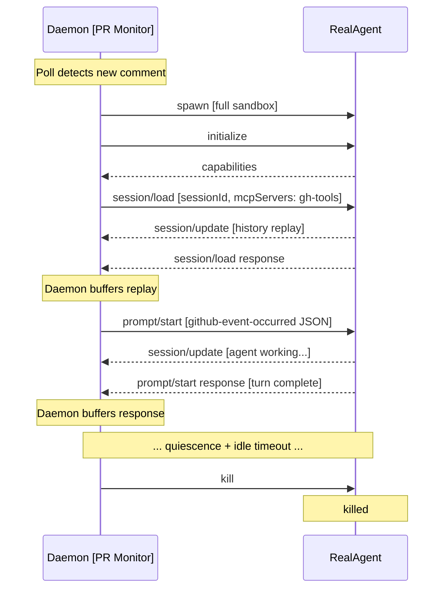
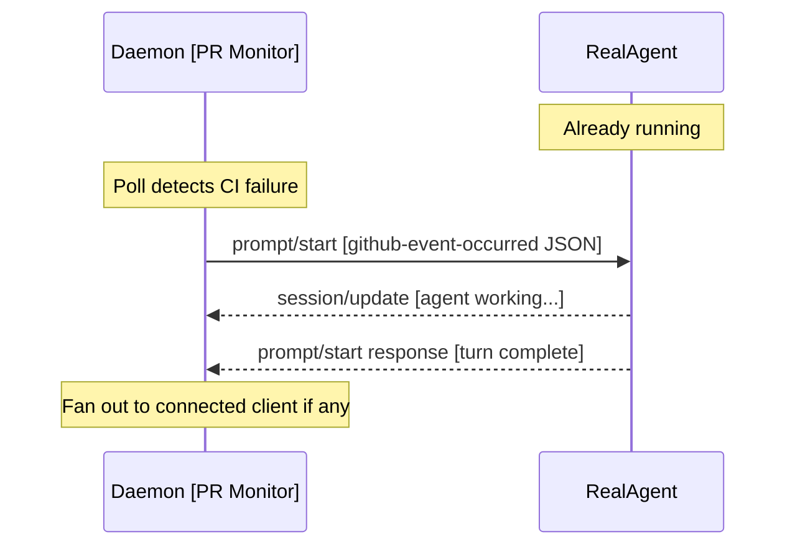
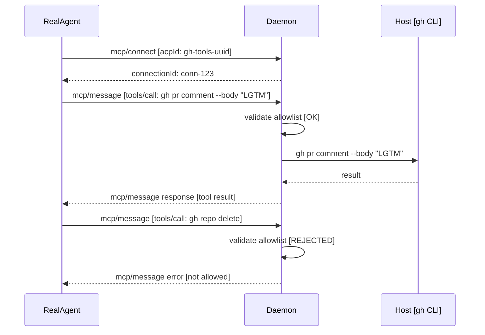

# Feature Specification: GitHub PR Integration

**Feature Branch**: `002-github-integration`

**Created**: 2026-06-03

**Status**: Draft

**Depends on**: `001-agent-daemon` (session lifecycle, ACP bridging, agent spawning)

**Input**: Extracted from `001-agent-daemon` spec — GitHub PR event monitoring and agent response capabilities

## User Scenarios & Testing *(mandatory)*

### User Story 2 - GitHub PR Event Ingestion (Priority: P2)

When an agent session is rooted in a directory with a GitHub remote, and there's a PR associated with the current branch, the daemon monitors that PR for relevant events (comments, reviews, CI status, state changes). Events from the authenticated user and CI/system actors are delivered to the agent as structured prompts.

**Why this priority**: This is the key differentiator — enabling agents to react to PR activity without human intervention. Depends on the session infrastructure from P1.

**Independent Test**: Can be tested by creating a PR on a branch, posting a comment from the authenticated user, and verifying the agent session receives the event and can act on it.

**Acceptance Scenarios**:

1. **Given** a session directory with a GitHub remote and a PR on the current branch, **When** the daemon discovers the session, **Then** it begins monitoring the PR with adaptive polling.
2. **Given** a session directory with no PR yet, **When** a PR is created for the branch later, **Then** the daemon discovers it on the next poll cycle and begins monitoring.
3. **Given** an active PR monitor, **When** the authenticated user posts a comment on the PR, **Then** the event is delivered to the agent via `prompt/start`.
4. **Given** an active PR monitor, **When** a CI check completes (pass or fail), **Then** the event is delivered to the agent via `prompt/start`.
5. **Given** an active PR monitor, **When** the PR is merged or closed, **Then** the state change event is delivered to the agent.
6. **Given** a comment from a user other than the locally authenticated user (and not a CI/system event), **When** the event is received, **Then** it is ignored to prevent data exfiltration.

---

### User Story 3 - Agent Responds to PR Events Asynchronously (Priority: P3)

The agent, having received PR events as context, can take actions in response — such as pushing code fixes, posting review replies, or updating the PR description. The agent is given interaction guidelines at session creation defining how it should behave.

**Why this priority**: This delivers the full autonomous loop, but only works once both session management and event ingestion are in place.

**Independent Test**: Can be tested by injecting a simulated PR comment into a session and verifying the agent produces an appropriate response action (e.g., posts a reply comment).

**Acceptance Scenarios**:

1. **Given** a PR comment injected into the session, **When** the agent processes it, **Then** it can post a reply comment on the PR via the `gh` MCP tool.
2. **Given** a CI failure event injected into the session, **When** the agent processes it, **Then** it can examine the failure and push a fix commit.
3. **Given** the agent is about to interact with GitHub, **When** it formulates an action, **Then** it operates within the permissions and guidelines provided in its interaction context.

---

### Edge Cases

- What happens when the git remote URL changes while a session is active?
- What happens if the GitHub API rate limit is exceeded during polling?
- What happens when multiple PRs exist for the same branch (e.g., to different base branches)?

## Requirements *(mandatory)*

### Functional Requirements

**GitHub PR Integration**

- **FR-001**: System MUST detect GitHub remotes in a session's working directory by inspecting git remote URLs.
- **FR-002**: System MUST discover PRs associated with the current branch. If no PR exists yet, re-check on each poll cycle.
- **FR-003**: System MUST poll for PR events using adaptive backoff: 5s -> 10s -> 30s -> 60s ceiling after each detected event. Reset to 5s when a new event is found.
- **FR-004**: System MUST capture: PR comments, reviews, review comments (inline), CI check run results, PR state changes (merged/closed/reopened), and new commits pushed.
- **FR-005**: System MUST filter all events: only events from the locally authenticated GitHub user (via `gh auth status`) and CI/system actors are accepted. All others are discarded.
- **FR-006**: When a GitHub event arrives, the daemon MUST spin up the agent (if not running, via `session/load`) and submit the event via `prompt/start` in a structured format:
  ```
  <github-event-occurred>
  {"type": "comment", "author": "...", "body": "...", ...}
  </github-event-occurred>
  ```
- **FR-007**: The daemon MUST track the last-delivered event ID per session (persisted in the state file) to avoid re-delivering events after daemon restart.

**MCP gh Tool**

- **FR-008**: System MUST run each agent with no network access (empty network namespace).
- **FR-009**: System MUST provide agents with a single `gh` MCP tool via MCP-over-ACP (`"type": "acp"` transport declared in `session/new`/`session/load`). The tool accepts an `args` array (e.g., `["pr", "comment", "--body", "LGTM"]`). The daemon handles `mcp/connect`, `mcp/message`, and `mcp/disconnect` on the same stdio pipe.
- **FR-010**: The daemon MUST validate each `gh` subcommand against a configurable allowlist before execution. Rejected commands return an MCP error.

### Key Entities

- **PR Monitor**: A component in the daemon that polls a GitHub PR for relevant events using adaptive backoff. Runs independently of the agent process. Tracks last-delivered event ID to avoid re-delivery.
- **GitHub Event**: A structured representation of a PR event (comment, review, CI check, state change, push) that is delivered to the agent as a `prompt/start` message.
- **gh MCP Tool**: An MCP tool server provided to the agent via MCP-over-ACP, allowing it to execute allowed `gh` CLI commands from within the sandbox.

## Success Criteria *(mandatory)*

### Measurable Outcomes

- **SC-001**: PR events are captured and available to the agent within 5 seconds of occurring on GitHub (during active polling at minimum interval).
- **SC-002**: 100% of events from non-authenticated, non-system users are filtered out (zero data exfiltration from external actors).
- **SC-003**: The agent can successfully execute allowed `gh` commands and receive their output.
- **SC-004**: Disallowed `gh` commands are rejected with a clear error 100% of the time.

## Sandboxing: Structured External Access (MCP-over-ACP)

The daemon communicates with the sandboxed agent exclusively over stdio using the Agent Client Protocol. The agent has no network access (empty network namespace via bwrap, provided by 001-agent-daemon's sandbox infrastructure).

- The daemon declares a `gh` MCP tool server with `"type": "acp"` transport when creating/loading the session.
- When the agent sends `mcp/connect` (referencing the `gh-tools` server ID), the daemon responds with a `connectionId`.
- When the agent sends `mcp/message` with a tool call, the daemon validates the `gh` subcommand against the allowlist, executes it outside the sandbox, and returns the result via `mcp/message` response.
- The agent cannot perform arbitrary HTTP requests or run arbitrary commands — its only escape hatch is stdio (the ACP channel).

### `gh` Command Allowlist

The daemon permits only specific `gh` subcommands. Initial allowlist:

- `gh pr view` — read PR metadata and body
- `gh pr checks` — read CI check status
- `gh pr comment` — post a comment on the PR
- `gh pr diff` — read the PR diff
- `gh api` — restricted to specific read endpoints (e.g., PR reviews, comments)

All other `gh` subcommands are rejected with an error. The allowlist is configurable.

## Assumptions

- The GitHub CLI (`gh`) is installed and authenticated on the user's machine.
- The working directory is a git repository with at least one remote.
- Polling (rather than webhooks) is the only viable approach for PR event detection, since this runs on a developer's local machine without a public endpoint.
- One PR per branch is the common case; if multiple PRs exist, the system monitors the most recently updated one.
- The daemon's sandbox infrastructure (from 001-agent-daemon) provides the bwrap environment with no network access.
- The MCP-over-ACP transport mechanism is provided by the daemon's ACP infrastructure (from 001-agent-daemon).
- ACP turns are serialized — only one `prompt/start` may be in flight at a time per session.
- GitHub events MUST be queued if the agent is mid-turn (a `prompt/start` is in flight). The daemon delivers queued events as `prompt/start` requests sequentially after the current turn completes.

## Sequence Diagrams

### 1. GitHub Event — Agent Dead



### 2. GitHub Event — Agent Alive



### 3. Agent Calls `gh` Tool (MCP-over-ACP)



## Appendix: ACP Protocol Reference

For the full ACP protocol reference (initialization, session lifecycle, prompt/start, session/update, and MCP-over-ACP message formats), see `specs/001-agent-daemon/spec.md` Appendix sections A1-A6. The MCP-over-ACP protocol (A5) is particularly relevant to this feature.
